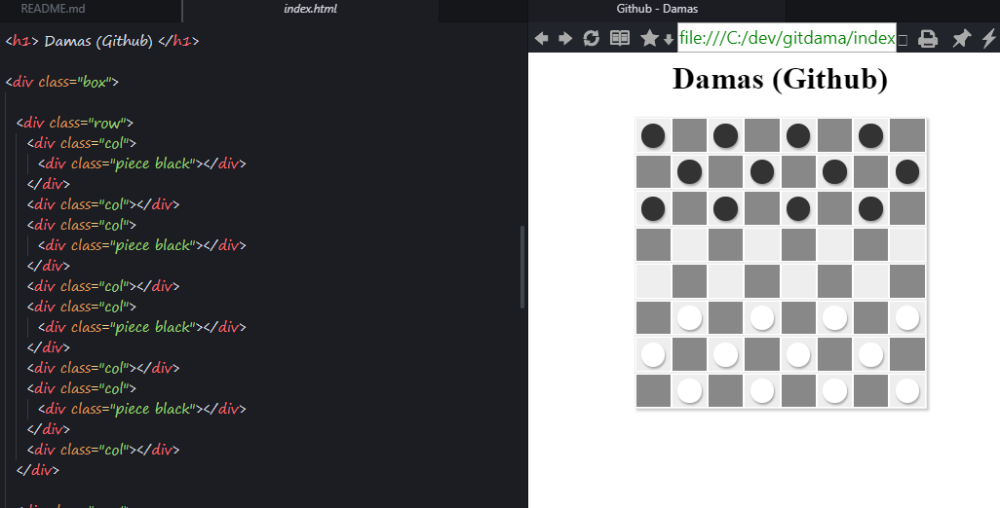

# Github DMS

Um game jogo de damas para desenvolvedores.

## Como jogar

- Clone o repositorio

- Cria uma nova pasta dentro da pasta desafios. Essa pasta deve conter
os ***usernames*** de cada participante do jogo. Exemplo: ***brunoom1-vs-player***. nesse caso seria
o jogador Gabriel Mendonca vs Luiz Ribeiro. Na primeira batalha.

- Copie o index.html para a pasta do desafio, arrume as peças
de acordo com o seu jogo e renomeie o arquivo para ***desafio-1.html***

- Faça seu primeiro lance alterando a localização da sua peça
no html.

- A cada lance realizado, faça um commit no seguinte formato:

  > Realizar jogada (A4, A6)
  >
  > Pode escrever um comentário lshoegal, tipo, depois desse lance, você não
  > tem mais como pra você Luiz

- Não esqueça de remover a pedra do seu adversário quando você a
pegar no jogo.

- Avise seu amigo sobre o desafio e passe o link do repositorio
para ele.

;-) --> Bom jogo.
========
